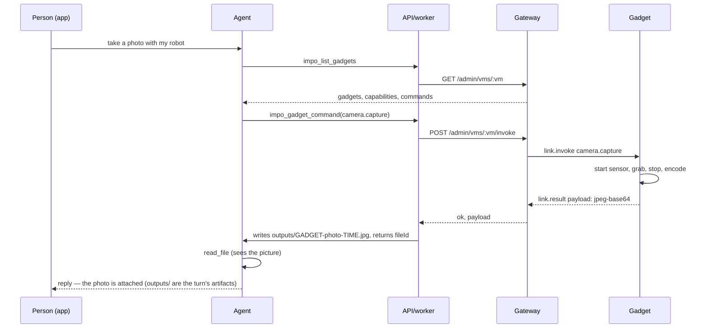
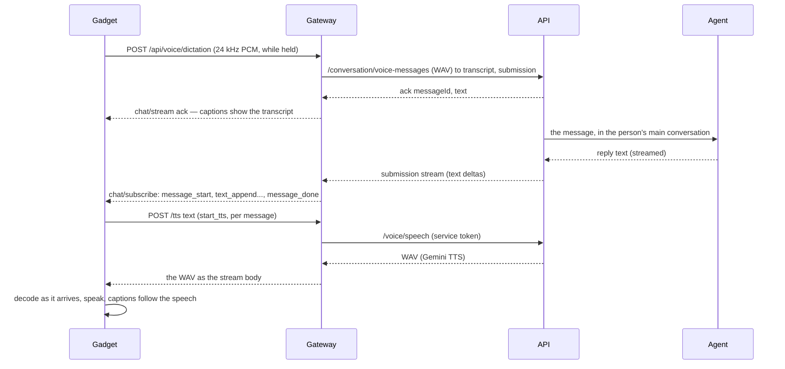
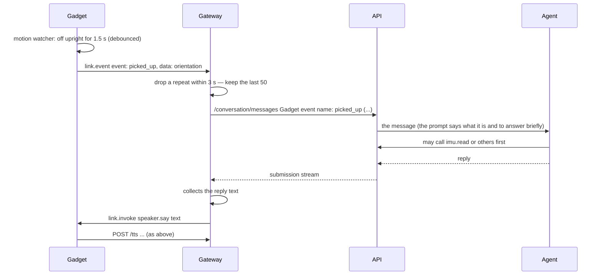

<!--
Copyright (c) Impo contributors.

Licensed under the Apache License, Version 2.0 (the "License");
you may not use this file except in compliance with the License.
You may obtain a copy of the License at

    http://www.apache.org/licenses/LICENSE-2.0

Unless required by applicable law or agreed to in writing, software
distributed under the License is distributed on an "AS IS" BASIS,
WITHOUT WARRANTIES OR CONDITIONS OF ANY KIND, either express or implied.
See the License for the specific language governing permissions and
limitations under the License.
-->

# Architecture

How a gadget, the gateway, the Impo server and the app fit together, what
each trusts, how the four things a gadget does move through them, and where
the system is meant to be extended. Everything here is open source: this
repository (firmware and Linux client) and [impoai/impo](https://github.com/impoai/impo)
(the gateway under `server/gadget-gateway`, the API and worker under
`server/`, the apps). [`docs/architecture.html`](docs/architecture.html)
draws it; [`CAPABILITIES.md`](CAPABILITIES.md) is the command contract;
[`docs/GADGET-AGENTS.md`](docs/GADGET-AGENTS.md) is the next layer.

## Components

| Component | Where | Runs on | Owns |
|---|---|---|---|
| Firmware | `esp32/` | the gadget (ESP32, ESP-IDF) | the board, the UI, voice, the Link client, commands, events |
| Linux client | `linux/` | a Linux box, as a Python package | the same protocol without a board |
| Gateway | `impo/server/gadget-gateway` | Cloudflare Worker + one Durable Object per account | sessions, pairing, invoke/result, events, the TTS proxy, reply relay |
| API + worker | `impo/server` | ECS (two services, one image) | accounts, chat, the agent's tools (`impo_list_gadgets`, `impo_gadget_command`), voice (STT, TTS), photo delivery |
| Agent | Rebyte session per conversation | a sandbox | the conversation; reads gadget commands as tools, writes files the app shows |
| Apps | `impo/ios`, `impo/android`, `impo/web` | the phone | BLE pairing, the gadget list, the chat, attachments |

The rings, from the inside out (see `docs/GADGET-AGENTS.md` for ring 1):

```
ring 0  kernel    the agent + API + gateway: permissions, routing, memory, model choice
ring 1  gadget    user-made agents bound to gadgets (proposed)
ring 2  devices   firmware; the capability vocabulary; a board file per piece of hardware
ring 3  ecosystem skills/: other people's devices through a gadget's tunnel
```

## Identity and trust

Nothing on a gadget can reach another account, and no third-party key is
ever on a gadget.

- **Pairing** binds a gadget to one account. The app creates a pairing
  through the API (`POST /api/v1/gadgets/pairings`, the user's session) and
  hands the gadget, over BLE, the pairing record and its Wi-Fi. The record
  is a `pairing.json`: the route (the account's subject), a pairing id and a
  device token.
- **Device token**: HMAC-signed by the gateway (`tokens.mjs`), stateless,
  carries the route and the pairing id, refreshable (`POST
  /device_token/refresh`). Deleting the pairing (app, or `DELETE
  /admin/vms/:vm/pairings/:id`) rejects its tokens; an online gadget is told
  (`link.unpaired`) and wipes itself.
- **Session**: `GET /fetch_vms` with the device token returns a five-minute
  bearer; `GET /v1/noise` upgrades to a WebSocket and runs a Noise XX
  handshake (X25519, AES-GCM, SHA-256). Every frame after it is encrypted.
  Inside, HTTP-shaped streams are multiplexed; `POST /link-control` stays
  open for the control messages.
- **Gateway → API**: the gateway speaks to the Impo API with a service
  token and `X-Impo-Gadget-Subject: <route>`; the API allows that pair only
  `POST /conversation/messages`, `/conversation/voice-messages`,
  `/voice/speech` and reading those submissions. Everything else needs the
  person's own session.
- **API → gateway**: admin routes (`/admin/vms/:vm/...`) with the admin
  token, used by the API for pairings, listing and invoking.
- **Agent → gadget**: only through `impo_gadget_command`, which checks the
  command is one the gadget registered and not withheld (`device.ota`,
  `device.unpair`, shell commands), then invokes through the gateway on the
  route of the signed-in account.
- **Third-party services** (Gemini for STT/TTS/vision): called by the API
  with keys from its secret store. The gadget and the apps only ever see
  Impo endpoints.

## Protocol surfaces

| Surface | Between | What |
|---|---|---|
| BLE GATT (`ImpoGadget-…`) | app ↔ gadget | setup: Wi-Fi, the pairing record, `wifi.*` and `hatch.*` commands; the USB console speaks the same `key=value` lines after `>` |
| Gateway HTTP | gadget → gateway | `GET /fetch_vms`, `POST /device_token/refresh`, `GET /v1/noise` (WebSocket) |
| Noise session streams | gadget ↔ gateway | `POST /link-control` (control messages), `GET /identity`, `POST /chat/stream` (a message from the gadget), `POST /chat/subscribe` (replies, NDJSON events), `POST /tts` (speech), `/api/voice/dictation` (push-to-talk audio up) |
| Control messages | gadget ↔ gateway | `link.register {node_id, display_name, platform, version, commands_v2, capabilities}`, `link.invoke {id, command, params}` → `link.result {id, ok, payload, error}`, `link.event {event, data, uptime_ms}`, `link.unpaired`, heartbeats |
| Gateway admin HTTP | API → gateway | `GET /admin/vms/:vm` (pairings, devices, live sockets, chat, events, hub version), `POST .../pairings`, `DELETE .../pairings/:id`, `POST .../invoke`, `POST .../replies` |
| Impo API | app, gateway → API | `/api/v1/gadgets[...]`, `/api/v1/conversation/*`, `/api/v1/voice/transcriptions`, `/api/v1/voice/speech`, `/api/v1/files/...` |
| Agent tools | agent → API | `impo_list_gadgets`, `impo_gadget_command` |

## The four flows

### A command: "take a photo"



The worker turns the base64 into a sandbox file because the model reads
files, not base64 text, and because `/workspace/outputs/` is what the app
shows with a reply. The gadget holds the sensor's memory for the second a
photo takes and gives it back (CAPABILITIES.md, Memory).

### A voice turn: push-to-talk



The turn is the firmware's state machine (`impo_chat_session.cpp`): one
dictation stream, one chat post, N message streams, each spoken in order. A
reply the gateway can't speak is shown at reading pace. Replies to anything
the gadget didn't send are ignored by the turn (upstream's rule), which is
why an event's reply is spoken through `speaker.say` instead (below).

### An event: the gadget is picked up



Today every event goes to the main conversation. `docs/GADGET-AGENTS.md`
puts a router in front: events go first to the person's gadget agents that
subscribed to them, and to the conversation only when none did. A reply
that doesn't come is simply not spoken (Decisions, 1).

### A sound: "play this"

`speaker.play_url` fetches the MP3 on the gadget over HTTPS (the certificate
bundle is in the firmware), streaming each chunk into `impo_sound`, whose
decoder task turns MP3 or WAV into 16 kHz mono as it arrives and whose
buffers were allocated once at start-up. `speaker.say` streams the gateway's
WAV into the same module. The voice loop plays whatever is there when it is
free; a new sound replaces the old; `speaker.status` tells how the last one
went and names the URL it tried.

## Decisions

Settled, so that nothing below has to be argued twice.

1. **The platform and the agent fail fast.** A command to a gadget that is
   offline fails now, and the agent says so. An event whose reply doesn't
   come gets no reply. A scheduled task whose gadget is away is skipped and
   logged. A watch that loses its connection ends, and the person starts it
   again if they want it. Above the gadget nothing is queued, retried,
   given an expiry or made up later: the platform records what failed, and
   that is the whole mechanism. Firmware is free to retry inside one
   command's own time (a DMA buffer that wasn't there a moment ago, a
   sensor that needs a second poke): that is hardware's business, and the
   command still answers once, success or failure, within its timeout.
2. **Contention is handled the same way.** A new sound replaces the one
   playing (`impo_sound`); the screen shows the last thing written; the
   base takes one drive at a time and a second one fails as busy. No
   priorities, no arbitration service.
3. **Only the platform is always on.** The agent is woken per turn, a
   phone is online when it is in the foreground, a gadget is connected
   but fragile. So routing, records and the gadget list live in the
   platform; the agent is not responsible for reliability, and a gadget
   keeps only what it needs to behave on its own (a motion watcher, a
   base that stops itself).
4. **A desktop is a client and a gadget at once.** The desktop app
   carries the Linux gadget runtime (`linux/`, the `impogadget` package)
   as an embedded daemon: one account, one process, two identities. It
   registers its capabilities (`system.run`, `file.*`, and in time the
   screen, camera and microphone) like any gadget, and the Linux box, the
   desktop and the ESP32 firmware speak the same `link.*` messages, so
   consistency is in the code, not in a document.
5. **Watching is a mode, not a message.** A gadget at rest sends discrete,
   debounced events (`link.event`). Watching (`watch.start`, with what,
   how long, how often, and `watch.stop`) is a state it enters on request,
   streams observations from, and leaves on a timeout, low battery or a
   stop. What it streams is shown to the person live and not written into
   the conversation or kept; only the discrete events a perception worker
   derives from it ("someone came in") reach the agent, like any other
   event.
6. **Things that move need a person's say-so.** Nothing automated drives
   the base or anything else that moves unless the person asked for that
   behaviour explicitly (the `physical` grant in `docs/GADGET-AGENTS.md`).

## Where the state is

| State | Where | Notes |
|---|---|---|
| Pairing, Wi-Fi, settings | the gadget's NVS | `pairing.json`, networks, volume, BLE on/off |
| Pairings, device registrations, last 50 messages and events | the account's Durable Object storage | the gateway's only state; stateless tokens |
| Conversations, memory, attachments, gadget list cache | the API's Postgres and S3 | the gadget list is read from the gateway each time |
| The agent's files | the Rebyte sandbox | `/workspace/outputs/` is delivered; the rest is scratch |
| Nothing | third-party services | STT/TTS requests carry no identity and store nothing (`store: false`) |

## Where the system is extended

| To add | Touch | Don't touch |
|---|---|---|
| A board | one file filling `impo_board_t`, a `sdkconfig` overlay, a line in `board.sh`/`ports.py`/`Kconfig`/the tables (`esp32/components/impo/boards/README.md`) | protocol, gateway, API, app |
| A command for one board | that board's `commands` table | — |
| A command every board shares | `impo_commands.c` + a row in CAPABILITIES.md | the gateway (it passes any name through) |
| An event | `impo_link_send_event` from the board + a row in CAPABILITIES.md | the gateway (it passes any name through) |
| A capability needing new plumbing (a stream) | CAPABILITIES.md first, then firmware, gateway, API, app | board files |
| A third-party device | a `skills/*/SKILL.md` | firmware |
| How the agent treats gadgets | `gadgetInstructions` in `impo/server/src/tools/gadget-tools.ts` (platform), each command's description (maker), skills (device) | — |
| The speech or vision provider | `impo/server/src/voice/` | firmware, gateway |
| User-made behaviour on events | gadget agents (proposed) | firmware |

## Running your own

All of it can be self-hosted: the gateway deploys with `wrangler deploy`
and two secrets (`TOKEN_SECRET`, `ADMIN_TOKEN`) plus the API's URL and
service token; the API and worker are one container image; the firmware
follows `api_url_v2` and `noise_host` from setup, with `gadgets.impo.ai` as
the default (`impo_settings.c`). A guide that walks through the whole stack
on one machine is still to be written (see the roadmap below).

## Roadmap

In the order they unblock each other:

1. Gadget agents, phase 1 (rules), with the kernel's arbitration: one sound
   at a time, budgets, quiet hours, `physical` consent.
2. The Linux client implementing the capability vocabulary, and a host test
   that checks every registered command against CAPABILITIES.md.
3. The self-hosting guide and a local loop (gateway, API, firmware pointed
   at it).
4. Prebuilt firmware per board, flashed from a web page.
5. The tunnel on the gateway, which makes ring 3 real.
6. `watch.*`, the observation stream and the perception worker (Decisions, 5).
